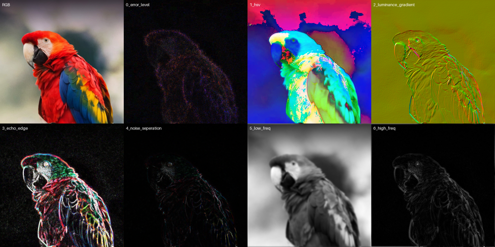

<div align="center">
<picture>
  <source media="(prefers-color-scheme: dark)" srcset="docs/logo_dark.png">
  <source media="(prefers-color-scheme: light)" srcset="docs/logo_light.png">
  
</picture>
</div>

## What is WITNESS?
WITNESS is the open-source image analysis framework developed by [Adaptive Sampling Group](https://adaptivesamplinggroup.com), providing the world with a signal processing toolkit to better understand the latent architecture behind the visual abstraction.

<p align="center">
  
</p>

## What is the Adaptive Sampling Group?
If you change the visual record, you rewrite history.

We are master forgers - VFX engineers and computational neuroscientists - leveraging classical optics, computer graphics and digital forensics, in concert with latest forgery and manipulation techniques.

The rapid advancement of image editing technology has resulted in forgeries becoming increasingly difficult to detect. To address this issue, we offer commercial tools and services (both human in the loop and AI/ML) to identify and validate visual content, distinguishing between authentic and doctored images.

We are currently focused on academia, journalism and legal applications, but open to discussion with all industries which require assistance.

## Installation
```
pip install -r requirements.txt
```

## OpenEXR
Data transport utilises the [OpenEXR](https://openexr.com/en/latest/) python library; providing a image storage format which accurately and efficiently represents high-dynamic-range scene-linear image data while supporting multiple AOVs.

##### Linux
```
pip install OpenEXR
```

##### OSX :: [Homebrew](https://brew.sh) required
```
brew install openexr
export CFLAGS="-I/Users/USERNAME/homebrew/include/OpenEXR -std=c++11"
export LDFLAGS="-L/Users/USERNAME/homebrew/lib"
pip install OpenEXR
```

## Protocols :: WIP
<details>
<summary>1. Metadata</summary>

- File
- [EXIF](https://en.wikipedia.org/wiki/Exif)
- Thumbnails
- GPS (Latlong)
</details>

<details>
<summary>2. Camera Settings</summary>

- Sensor
- Exposure
- Aperture
- Shutter speed
- Focal length
- File type & resolution
- Flash
- Gyro
- PRNU Identification
- Sensor
- Film Stock
</details>

<details>
<summary>3. Header</summary>

- Display structure (Hex & ASCII)
- Hex editor
- Tags
</details>

<details>
<summary>4. Optics & Compositing</summary>

- Shadows
- Reflection
- Illuminant estimation
- Photogrammetry
- Perspective
- Field of view
- Vanishing points & lines
- DOF
- Lens flare
- Lens distortion
- Motion blur
- Noise / Grain
- Chromatic abberation
- Spectral analysis
- Fractal analysis
- Resampling and compression
- Edges and masking
- Colour grading
    - Colour match
    - Dynamic range
    - Luminance offset
</details>

<details>
<summary>5. Tables</summary>

- Exposure
- APEX
</details>

<details>
<summary>6. Image Processing</summary>

- Source
- Luminance gradient
- PCA projection
- Edge detection (Gabor - simple cell, Laplace - sparse, Echo)
- Wavelet threshold
- Frequency split
- Fourier transform (FFT) analysis
- Noise seperation
- UV distortion
- Cloning (Harris Detector)
- Space conversion (RGB, HSV, LAB, etc.)
- Bit plane values
- Min/max deviation
- Noise / grain seperation
- Error level analysis
- Quality estimation
- Contrast enhancement
- Luminance Offset
- Median filtering
- Estimated noise print
- Splicing probability
- Dead/hot pixels
- High pass filter
- Resampling
</details>

<details>
<summary>7. JPEG Signature</summary>

- Quantisation (Chroma | Luma)
- Marker packaging
- DCT & Huffman
- Ghosts
</details>

<details>
<summary>8. Interface</summary>

- Inspection / Review
  - [OpenRV](https://github.com/AcademySoftwareFoundation/OpenRV)
  - Functionality:
    - Global adjustments (gamma, contrast and brightness), channels & magnification
    - Histogram
    - Pixel statistics
    - Synchronised comparison ??? (Difference, SSIM map, Butteraugli)
    - [OpenEXR](https://openexr.com/en/latest/) > Data transport
    - [OCIO](https://opencolorio.org) > Lookup
</details>